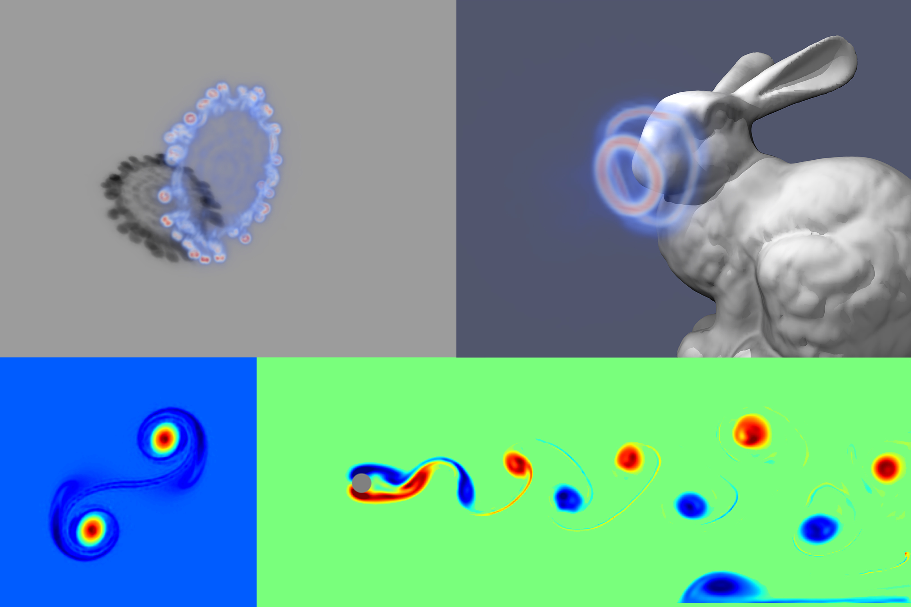

# Gaussian Fluids: A Grid-Free Fluid Solver based on Gaussian Spatial Representation

### [Project Page](https://xjr01.github.io/GaussianFluids/)  | [Paper](https://xjr01.github.io/files/GaussianFluids.pdf)



Official implementation for the paper:
> **[Gaussian Fluids: A Grid-Free Fluid Solver based on Gaussian Spatial Representation]()**  
> [Jingrui Xing](https://xjr01.github.io/)<sup>1</sup>, [Bin Wang](https://binwangbfa.github.io/)<sup>2</sup>, [Mengyu Chu](https://rachelcmy.github.io/)<sup>1</sup>, [Baoquan Chen](https://baoquanchen.info/)<sup>1</sup> <br>
> <sup>1</sup>Peking University, <sup>2</sup>Independent Researcher <br>
> SIGGRAPH 2025


## Installation
Prerequisites:
- python 3.9+
- An NVIDIA GPU with CUDA 11+

Firstly, install dependencies in `requirements.txt`:
```bash
pip install -r requirements.txt
```

Next, install PyTorch with a compatible version for your CUDA. Please check https://pytorch.org/ for details.

Finally, install Taichi language:

```bash
pip install taichi
```

## Running

### 2D Examples

To run 2D examples, go into directory `2D` first:

```bash
cd 2D
```

Next, run the initial fitting process (take Leapfrog 2D as an example):

```bash
python initialize.py --init_cond leapfrog --dir output_2d_leapfrog
```

The visualization results can then be found in directory `output_2d_leapfrog`.

Finally, run the simulation:

```bash
python advance.py --init_cond leapfrog --dt .025 --last_time 40. --dir output_2d_leapfrog > output_2d_leapfrog/log.txt
```

This command will run silently as its outputs are redirect into `output_2d_leapfrog/log.txt`. The visualizations of each frame will also be stored in `output_2d_leapfrog`.

Similar steps can be done to reproduce other examples in the paper.

Taylor-Green:

```bash
python initialize.py --init_cond taylor_green --dir output_2d_taylor_green
python advance.py --init_cond taylor_green --dt .001 --last_time .2 --dir output_2d_taylor_green > output_2d_taylor_green/log.txt
```

Taylor vortex:

```bash
python initialize.py --init_cond taylor_vortex --dir output_2d_taylor_vortex
python advance.py --init_cond taylor_vortex --dt .01 --last_time 4. --dir output_2d_taylor_vortex > output_2d_taylor_vortex/log.txt
```

Vortices pass:

```bash
python initialize.py --init_cond vortices_pass_particles --dir output_2d_vortices_pass
python advance.py --init_cond vortices_pass_particles --dt .01 --last_time 5. --dir output_2d_vortices_pass > output_2d_vortices_pass/log.txt
```

Karman vortex street:

```bash
python initialize.py --init_cond karman --dir output_2d_karman
python advance.py --init_cond karman --dt .05 --last_time 10. --dir output_2d_karman > output_2d_karman/log.txt
```

### 3D Examples

To run 3D examples, go into directory `3D` first:

```bash
cd 3D
```

Then follow the same steps as in 2D examples. The following shows the command lines for all the 3D examples.

Leapfrog 3D:

```bash
python initialize.py --init_cond leapfrog --dir output_3d_leapfrog
python advance.py --init_cond leapfrog --dir output_3d_leapfrog > output_3d_leapfrog/log.txt
```

Ring collide:

```bash
python initialize.py --init_cond ring_collide --dir output_3d_ring_collide
python advance.py --init_cond ring_collide --dir output_3d_ring_collide > output_3d_ring_collide/log.txt
```

Smoking bunny:

```bash
python initialize.py --init_cond ring_with_obstacle --dir output_3d_ring_with_obstacle
python advance.py --init_cond ring_with_obstacle --dir output_3d_ring_with_obstacle > output_3d_ring_with_obstacle/log.txt
```

### More Options

You can assign both processes (`initialization.py` and `advance.py`) to any GPU by specifying `--device` option. For example, you can run simulation of the Leapfrog 2D example on GPU 2 with the following command line:

```bash
python advance.py --device 2 --init_cond leapfrog --dt .025 --last_time 40. --dir output_2d_leapfrog > output_2d_leapfrog/log.txt
```

You can start simulation from a certain frame specified with `--start_frame` option. For example, start simulation of the Leapfrog 2D example from frame $100$ by (please make sure file `gaussian_velocity_100.pt` exists in `output_2d_leapfrog`):

```bash
python advance.py --start_frame 100 --init_cond leapfrog --dt .025 --last_time 40. --dir output_2d_leapfrog > output_2d_leapfrog/log_from_100.txt
```

## Citation

Coming soon!
